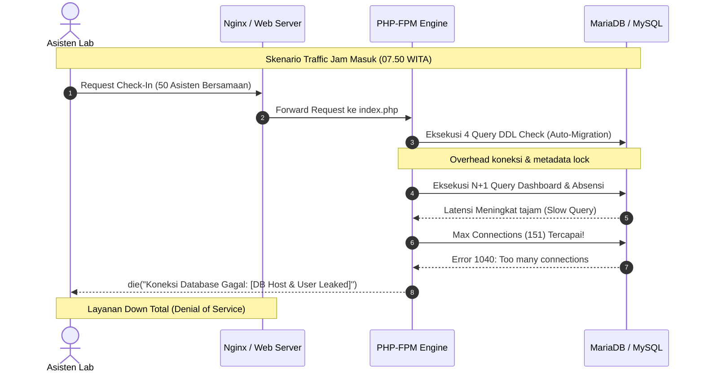
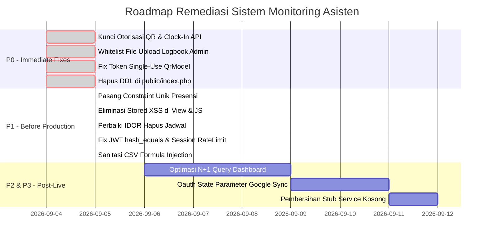

# LAPORAN AUDIT KEAMANAN, KEANDALAN SISTEM & PANDUAN REMEDIASI PENGEMBANG
## SISTEM MONITORING ASISTEN LABORATORIUM (ICLABS)

---

### DOKUMEN KONTROL & INFORMASI AUDIT

| Parameter | Keterangan |
|---|---|
| **Nama Project** | Sistem Monitoring Asisten Laboratorium (ICLABS) |
| **Arsitektur** | PHP Native MVC (Web) + REST API (Mobile/Flutter) + MySQL Database |
| **Tanggal Audit** | 4 September 2026 |
| **Versi Codebase** | V3 Stable / Post-Migration v10 |
| **Status Kelayakan Produksi** | 🔴 **PRODUCTION DEPLOYMENT BLOCKED** |
| **Auditor** | Senior Bug Hunter, Security Auditor & Production Readiness Engineer |
| **Target Penerima** | Tim Pengembang (Lead Developer, Backend Engineer, Mobile Engineer, DevOps) |
| **Klasifikasi** | Rahasia Internal (Confidential - Security & Technical Report) |

---

# DAFTAR ISI
1. [Ringkasan Eksekutif](#1-ringkasan-eksekutif)
2. [Matriks Penilaian Kelayakan Produksi (Production Readiness Scorecard)](#2-matriks-penilaian-kelayakan-produksi)
3. [Ringkasan Temuan Kerentanan & Bug](#3-ringkasan-temuan-kerentanan--bug)
4. [Laporan Detail Temuan & Panduan Perbaikan Developer (Actionable Fixes)](#4-laporan-detail-temuan--panduan-perbaikan-developer)
   - [4.1 Keamanan & Otorisasi API (P0 - Critical)](#41-keamanan--otorisasi-api-p0---critical)
   - [4.2 Keamanan File Upload & Eksekusi Kode (P0 - Critical)](#42-keamanan-file-upload--eksekusi-kode-p0---critical)
   - [4.3 Logika Bisnis & Penjadwalan (P0 & P1)](#43-logika-bisnis--penjadwalan-p0--p1)
   - [4.4 Keamanan Tampilan & Cross-Site Scripting (P1 - High)](#44-keamanan-tampilan--cross-site-scripting-p1---high)
   - [4.5 Integritas Basis Data & Konkurensi (P1 - High)](#45-integritas-basis-data--konkurensi-p1---high)
   - [4.6 Kinerja & Skalabilitas Sistem (P1 - High)](#46-kinerja--skalabilitas-sistem-p1---high)
   - [4.7 Manajemen Rahasia & Privasi Data (P1 - High)](#47-manajemen-rahasia--privasi-data-p1---high)
5. [Analisis Skenario Kegagalan Produksi (Failure Scenarios)](#5-analisis-skenario-kegagalan-produksi)
6. [Checklist Deployment Blockers (Wajib Diperbaiki Sebelum Live)](#6-checklist-deployment-blockers)
7. [Roadmap Remediasi & Rencana Aksi Developer](#7-roadmap-remediasi--rencana-aksi-developer)
8. [Prosedur Verifikasi & Uji Regresi Pasca-Perbaikan](#8-prosedur-verifikasi--uji-regresi-pasca-perbaikan)
9. [Lembar Pengesahan Rilis (Sign-off)](#9-lembar-pengesahan-rilis)

---

# 1. RINGKASAN EKSEKUTIF

Audit komprehensif pra-produksi telah dilaksanakan terhadap keseluruhan repositori kode **Sistem Monitoring Asisten Laboratorium (ICLABS)** yang mencakup logika backend MVC, antarmuka web pengguna dan administrator, endpoint REST API untuk aplikasi mobile, struktur skema basis data, dan konfigurasi deployment.

Secara fungsional dan antarmuka (UI/UX), sistem telah mengimplementasikan fitur-fitur operasional laboratorium yang kaya, seperti absensi berbasis kode QR dinamis, anti-fraud foto selfie, sinkronisasi Google Calendar, logbook digital harian, dan sistem pemulihan data (Recycle Bin).

Namun, dari sudut pandang **Application Security, Data Reliability, dan Production Stability**, sistem ini **BELUM MEMENUHI SYARAT KELAYAKAN MINIMUM UNTUK DEPLOYMENT PRODUKSI**. Ditemukan kelemahan fundamental yang memungkinkan:
1. **Bypass Presensi Total:** Pengguna aplikasi mobile dapat melakukan absensi masuk tanpa harus berada di laboratorium atau memindai kode QR fisik.
2. **Eskalasi Hak Akses (Privilege Escalation):** Asisten biasa dapat men-generate token kode QR resmi melalui REST API.
3. **Penghapusan Data Ilegal (IDOR):** Endpoint penghapusan jadwal tidak memvalidasi kepemilikan data pengguna.
4. **Potensi Remote Code Execution (RCE):** Modul logbook administrator menerima file upload tanpa validasi ekstensi dan MIME type.
5. **Stored Cross-Site Scripting (XSS):** Input logbook dan jadwal asisten dieksekusi sebagai script pada browser Administrator dan Kepala Lab.
6. **Kegagalan Skalabilitas (N+1 Query Cascade):** Dashboard administrator mengeksekusi ratusan query dan ribuan iterasi tanggal PHP per request, yang akan menyebabkan kehabisan koneksi basis data pada jam sibuk pagi hari.

Oleh karena itu, status rilis dinyatakan **🔴 BLOCKED (DITAHAN)** sampai perbaikan pada kategori P0 dan P1 selesai diterapkan dan diverifikasi ulang.

---

# 2. MATRIKS PENILAIAN KELAYAKAN PRODUKSI

| Kategori Evaluasi | Skor (1-10) | Status | Keterangan Evaluasi |
|---|---:|:---:|---|
| **Code Quality & Architecture** | 6.5 / 10 | 🟡 Cukup | Pola MVC native terstruktur, namun terdapat dead-code stub kosong. |
| **Application Security** | 3.0 / 10 | 🔴 Kritis | Risiko RCE pada file upload, Stored XSS, dan CSRF pada OAuth. |
| **Authentication System** | 5.0 / 10 | 🟠 Rentan | JWT timing attack, brute-force rate limiter berbasis session lokal. |
| **Authorization & RBAC** | 3.5 / 10 | 🔴 Kritis | IDOR pada API jadwal, QR generator tidak dibatasi role Admin. |
| **REST API Security** | 3.0 / 10 | 🔴 Kritis | Clock-in tanpa validasi token QR/GPS, bocoran raw SQL error ke JSON. |
| **Database Reliability** | 4.0 / 10 | 🟠 Rentan | Ketiadaan constraint unik presensi harian, potensi duplikasi data. |
| **Performance Efficiency** | 4.0 / 10 | 🟠 Lambat | N+1 query loop di dashboard, DDL schema query di setiap request HTTP. |
| **Scalability & Concurrency** | 3.5 / 10 | 🔴 Buruk | Koneksi persisten PDO dan loop tanggal PHP tidak tahan traffic jam sibuk. |
| **Infrastructure & Web Server** | 5.5 / 10 | 🟡 Cukup | Sangat bergantung pada Apache `.htaccess`; rentan jika deploy Nginx. |
| **Deployment Readiness** | 3.0 / 10 | 🔴 Kritis | Database SQL dump riil berada di root folder, DDL run at request-time. |
| **Observability & Logging** | 5.0 / 10 | 🟡 Dasar | Error log file lokal tersedia, belum ada tracing request ID / APM. |
| **Disaster Recovery** | 5.0 / 10 | 🟡 Cukup | Ada migration runner CLI, belum ada skema backup otomatis. |

### TOTAL PRODUCTION READINESS SCORE: **42 / 100**
> **Klasifikasi:** 🔴 **PRODUCTION DEPLOYMENT MUST BE BLOCKED**

---

# 3. RINGKASAN TEMUAN KERENTANAN & BUG

| ID Temuan | Kategori | Tingkat Keparahan | Komponen Terdampak | Dampak Terhadap Produksi | Prioritas |
|---|---|:---:|---|---|:---:|
| **SEC-01** | Authorization | **CRITICAL** | `app/api/QrApi.php` | Asisten dapat generate token QR absensi resmi dari rumah | **P0** |
| **SEC-02** | Business Logic | **CRITICAL** | `app/api/AttendanceApi.php` | Absensi masuk via API tembus tanpa validasi QR token & GPS | **P0** |
| **SEC-03** | Authorization | **HIGH** | `app/api/ScheduleApi.php` | IDOR: Asisten dapat menghapus jadwal milik asisten lain | **P1** |
| **SEC-04** | File Handling | **CRITICAL** | `app/controllers/AdminController.php` | Upload file bebas ekstensi pada logbook admin (RCE Shell) | **P0** |
| **SEC-05** | Injection (XSS) | **HIGH** | `app/views/` & JS Logbook | Stored XSS: Pembajakan sesi Administrator & Kepala Lab | **P1** |
| **SEC-06** | Authentication | **HIGH** | `AuthController` & `AuthApi` | Rate limit login mudah dibypass (Session-scoped & API nihil) | **P1** |
| **SEC-07** | Cryptography | **MEDIUM** | `app/core/JwtHandler.php` | Verifikasi signature JWT rentan timing attack & token di URL | **P1** |
| **SEC-08** | Authentication | **MEDIUM** | `app/core/GoogleClient.php` | OAuth CSRF (Ketiadaan state) & token plaintext di database | **P2** |
| **SEC-09** | Injection | **MEDIUM** | Fitur Export CSV | Formula Injection / CSV Injection di Microsoft Excel | **P1** |
| **LOGIC-01**| Business Logic | **HIGH** | `app/models/QrModel.php` | Token single-use QR tetap tampil di layar lab (Antrean macet) | **P0** |
| **LOGIC-02**| Authorization | **HIGH** | `app/api/AuthApi.php` | Akun dinonaktifkan Admin masih bisa akses penuh via API | **P1** |
| **DATA-01** | Database | **HIGH** | Tabel `presensi` & Model | Tidak ada UNIQUE constraint (Data presensi ganda) | **P1** |
| **PERF-01** | Performance | **HIGH** | Dashboard Admin & Kepala Lab | N+1 Query Cascade & iterasi tanggal PHP (Server hang) | **P1** |
| **PERF-02** | Performance | **HIGH** | `public/index.php` | 4 Query DDL dijalankan sinkron di setiap request HTTP | **P0** |
| **DEPL-01** | Information Leak| **HIGH** | Root Directory | SQL Dump riil dan .env terekspos jika DocumentRoot salah | **P0** |

---

# 4. LAPORAN DETAIL TEMUAN & PANDUAN PERBAIKAN DEVELOPER

Bagian ini disusun khusus untuk **tim developer** sebagai panduan perbaikan berbasis kode (code-level remediation). Setiap sub-bab memuat lokasi file, kode saat ini, kelemahan sistem, dan rekomendasi solusi perbaikan.

---

## 4.1 KEAMANAN & OTORISASI API (P0 - CRITICAL)

### Temuan SEC-01: Hak Akses Pembuatan QR Code Tidak Dibatasi (Privilege Escalation)
* **File:** `app/api/QrApi.php` (Baris 20–35)
* **Status:** Confirmed Vulnerability
* **Analisis Masalah:**
  Endpoint `GET /api/qr/generate` hanya memvalidasi token JWT pengguna tanpa memeriksa role akun. Pengguna dengan role `User` (asisten) dapat memanggil endpoint ini dengan parameter `?type=Presensi&validity=86400` untuk membuat kode QR valid selama 24 jam di luar jam lab.
* **Kode Bermasalah Saat Ini:**
  ```php
  public function generate() {
      $payload = AuthApi::validateToken();
      $profilId = $payload['profil_id']; // Tidak ada validasi role Admin!
      ...
  ```
* **Panduan Perbaikan untuk Developer:**
  Tambahkan pengecekan role secara eksplisit tepat setelah validasi token:
  ```php
  public function generate() {
      $payload = AuthApi::validateToken();
      if (($payload['role'] ?? '') !== 'Admin') {
          ApiResponse::error('Akses ditolak. Fitur ini hanya untuk Administrator.', 403);
          exit;
      }
      ...
  ```

---

### Temuan SEC-02: Endpoint Clock-In API Tidak Memeriksa Kode QR & Geofence
* **File:** `app/api/AttendanceApi.php` (Baris 20–45)
* **Status:** Confirmed Vulnerability
* **Analisis Masalah:**
  Pada method `clockIn()`, sistem hanya menerima upload foto dan memeriksa apakah asisten sudah presensi hari ini. **Tidak ada verifikasi terhadap token QR code dan tidak ada validasi koordinat lokasi**. Siapa pun yang memiliki akses token API dapat memicu absensi hadir dari mana saja.
* **Panduan Perbaikan untuk Developer:**
  1. Wajibkan parameter `qr_token` pada payload request.
  2. Panggil model `QrModel` untuk validasi keabsahan token.
  3. Tandai token sebagai telah digunakan (`markTokenUsed`).
  ```php
  public function clockIn() {
      if ($_SERVER['REQUEST_METHOD'] !== 'POST') {
          ApiResponse::error('Method not allowed', 405);
      }

      $payload = AuthApi::validateToken();
      $profilId = $payload['profil_id'];
      $userId   = $payload['user_id'];

      // Wajibkan input token QR
      $qrToken = trim($_POST['qr_token'] ?? '');
      if (empty($qrToken)) {
          ApiResponse::error('Token QR wajib disertakan.', 400);
      }

      require_once '../app/models/QrModel.php';
      $qrModel = new QrModel();
      if (!$qrModel->validateToken($qrToken, 'check_in')) {
          ApiResponse::error('Token QR tidak valid, sudah kadaluarsa, atau telah digunakan.', 400);
      }

      // Validasi file foto presensi (lihat perbaikan SEC-04)
      ...
      
      // Setelah insert berhasil:
      $qrModel->markTokenUsed($qrToken, $userId);
  ```

---

### Temuan SEC-03: IDOR pada Endpoint Penghapusan Jadwal
* **File:** `app/api/ScheduleApi.php` (Baris 271–295)
* **Status:** Confirmed Vulnerability
* **Analisis Masalah:**
  Method `delete()` mengambil `id` dari JSON body dan langsung mengeksekusi:
  ```sql
  DELETE FROM jadwal_kuliah WHERE id_jadwal_kuliah = :id
  ```
  Tidak ada pengecekan apakah ID jadwal tersebut milik `id_profil` yang sedang login.
* **Panduan Perbaikan untuk Developer:**
  Ambil `profil_id` dari payload JWT dan masukkan ke dalam klausul `WHERE`:
  ```php
  public function delete() {
      $payload  = AuthApi::validateToken();
      $profilId = (int)$payload['profil_id'];
      $data     = json_decode(file_get_contents("php://input"), true);
      $id       = (int)($data['id'] ?? 0);

      if (!$id) {
          ApiResponse::error('ID jadwal tidak valid', 400);
      }

      $query = "DELETE FROM jadwal_kuliah WHERE id_jadwal_kuliah = :id AND id_profil = :pid";
      $stmt  = $this->conn->prepare($query);
      $stmt->execute([':id' => $id, ':pid' => $profilId]);

      if ($stmt->rowCount() === 0) {
          ApiResponse::error('Jadwal tidak ditemukan atau bukan milik Anda', 404);
      }
      ApiResponse::success(null, 'Jadwal berhasil dihapus.', 200);
  }
  ```

---

### Temuan LOGIC-02: Akun Suspended Tetap Lolos Mengakses API
* **File:** `app/api/AuthApi.php` (Baris 35–48 & 116–130)
* **Status:** Confirmed Flaw
* **Analisis Masalah:**
  Query login mobile tidak memeriksa status keaktifan akun:
  ```sql
  WHERE u.email = :email AND u.role = 'User'
  ```
  Asisten yang status akunnya diubah menjadi `INACTIVE` oleh Admin masih dapat login dan memanggil seluruh REST API.
* **Panduan Perbaikan untuk Developer:**
  1. Tambahkan `AND u.status_account = 'ACTIVE'` pada query `login()`.
  2. Pada `validateToken()`, tambahkan query verifikasi status akun ke tabel `user`.

---

## 4.2 KEAMANAN FILE UPLOAD & EKSEKUSI KODE (P0 - CRITICAL)

### Temuan SEC-04: Arbitrary File Upload pada Logbook Admin
* **File:** `app/controllers/AdminController.php` (Baris 1614–1640)
* **Status:** Confirmed Vulnerability
* **Analisis Masalah:**
  Fungsi `saveLogbookAdmin` mengambil ekstensi file secara langsung tanpa pencocokan whitelist:
  ```php
  $ext = pathinfo($_FILES["proof_file"]["name"], PATHINFO_EXTENSION);
  $fileName = "admin_edit_" . time() . "." . $ext;
  move_uploaded_file($_FILES["proof_file"]["tmp_name"], $targetDir . $fileName);
  ```
  Bila di-deploy pada server web Nginx (yang tidak memproses `.htaccess` Apache), file `.php` dapat diupload dan diakses via URL publik untuk mendapatkan Remote Code Execution (RCE).
* **Panduan Perbaikan untuk Developer:**
  Terapkan whitelist ekstensi, verifikasi MIME type via magic bytes, dan batasi ukuran file:
  ```php
  $allowedExts = ['jpg', 'jpeg', 'png', 'pdf'];
  $fileExt = strtolower(pathinfo($_FILES["proof_file"]["name"], PATHINFO_EXTENSION));

  if (!in_array($fileExt, $allowedExts, true)) {
      echo json_encode(['status' => 'error', 'message' => 'Format file tidak diizinkan. Hanya JPG, PNG, dan PDF.']);
      exit;
  }

  // Verifikasi MIME Type nyata (Magic Bytes)
  $finfo = finfo_open(FILEINFO_MIME_TYPE);
  $mime  = finfo_file($finfo, $_FILES["proof_file"]["tmp_name"]);
  finfo_close($finfo);

  $allowedMimes = ['image/jpeg', 'image/png', 'application/pdf'];
  if (!in_array($mime, $allowedMimes, true)) {
      echo json_encode(['status' => 'error', 'message' => 'Konten file tidak sesuai dengan ekstensinya.']);
      exit;
  }

  if ($_FILES["proof_file"]["size"] > 5 * 1024 * 1024) {
      echo json_encode(['status' => 'error', 'message' => 'Ukuran file maksimal 5MB.']);
      exit;
  }
  ```

---

## 4.3 LOGIKA BISNIS & PENJADWALAN (P0 & P1)

### Temuan LOGIC-01: Token Single-Use QR Terkunci di Layar Antrean Lab
* **File:** `app/models/QrModel.php` (Baris 14–24)
* **Status:** Confirmed Logic Bug
* **Analisis Masalah:**
  Ketika asisten pertama berhasil memindai QR, token ditandai `used_by_user_id = X`. Namun fungsi `getOrGenerateToken()` yang menampilkan QR di layar proyektor/monitor lab mengambil:
  ```sql
  SELECT * FROM qr_code 
  WHERE tipe = :t AND valid_until > DATE_ADD(NOW(), INTERVAL 30 SECOND) 
  ORDER BY id_qr DESC LIMIT 1
  ```
  Query di atas **tidak menyaring** token yang sudah terpakai. Akibatnya, monitor tetap menampilkan token yang sudah hangus. Asisten berikutnya yang memindai QR tersebut akan ditolak oleh fungsi validasi (`used_by_user_id IS NULL`) sampai batas waktu 3 menit berlalu.
* **Panduan Perbaikan untuk Developer:**
  Perbaiki query pada `app/models/QrModel.php`:
  ```php
  public function getOrGenerateToken($type) {
      $dbType = ($type == 'check_in') ? 'Presensi' : 'Pulang';

      $sql = "SELECT * FROM qr_code 
              WHERE tipe = :t 
                AND valid_until > DATE_ADD(NOW(), INTERVAL 30 SECOND)
                AND used_by_user_id IS NULL
              ORDER BY id_qr DESC LIMIT 1";
      
      $this->db->query($sql);
      $this->db->bind(':t', $dbType);
      $token = $this->db->single();

      if ($token) {
          return $token['token_code'];
      }
      
      return $this->generateFreshToken($type);
  }
  ```

---

## 4.4 KEAMANAN TAMPILAN & CROSS-SITE SCRIPTING (P1 - HIGH)

### Temuan SEC-05: Stored Cross-Site Scripting (XSS) pada Logbook & Jadwal
* **File Terdampak:**
  1. `app/views/admin/assistant_schedule.php` (Baris 138)
  2. `app/views/kepalalab/assistant_schedule.php` (Baris 135)
  3. `public/assets/js/admin/logbook.js` (Baris 226 & 242)
  4. `app/views/user/logbook.php` (Baris 156)
* **Status:** Confirmed Vulnerability
* **Analisis Masalah:**
  1. Variabel `$sch['description']` dicetak tanpa fungsi escaping HTML:
     ```html
     <span class="italic"><?= $sch['description'] ?></span>
     ```
  2. Pada file JavaScript `admin/logbook.js`, isi catatan aktivitas logbook (`log.activity`) langsung digabungkan ke string HTML tabel dan dipasang ke DOM melalui `tbody.innerHTML += row;`:
     ```javascript
     <p class="text-xs" title="${log.activity}">${log.activity}</p>
     <button onclick='openEditModal(${JSON.stringify(log)}, "edit")'>
     ```
  Payload berbahaya seperti `` akan otomatis tereksekusi pada browser Administrator atau Kepala Lab saat memeriksa daftar logbook asisten.
* **Panduan Perbaikan untuk Developer:**
  1. Pada file view PHP, bungkus selalu variabel teks dengan `htmlspecialchars`:
     ```php
     <span class="italic"><?= htmlspecialchars($sch['description'] ?? '', ENT_QUOTES, 'UTF-8') ?></span>
     ```
  2. Pada file JavaScript, buat fungsi sanitasi entitas HTML sebelum digabungkan ke elemen DOM:
     ```javascript
     function escapeHtml(str) {
         if (!str) return '';
         return String(str)
             .replace(/&/g, '&amp;')
             .replace(/</g, '&lt;')
             .replace(/>/g, '&gt;')
             .replace(/"/g, '&quot;')
             .replace(/'/g, '&#039;');
     }
     
     // Gunakan escapeHtml:
     const safeActivity = escapeHtml(log.activity || 'Tidak ada catatan');
     const row = `... <p title="${safeActivity}">${safeActivity}</p> ...`;
     ```
  3. Jangan passing objek JSON mentah di dalam inline handler HTML `onclick='openEditModal(${JSON.stringify(log)})'`. Gunakan `dataset` atau simpan di memori JavaScript berdasarkan indeks/ID.

---

## 4.5 INTEGRITAS BASIS DATA & KONKURENSI (P1 - HIGH)

### Temuan DATA-01: Ketiadaan Constraint Unik Presensi Harian (Race Condition)
* **File:** `iclabs_db.sql` (Baris 695–700) & `app/models/AttendanceModel.php` (Baris 29–45)
* **Status:** Confirmed Data Integrity Risk
* **Analisis Masalah:**
  Pola verifikasi presensi yang digunakan adalah *read-then-write*:
  ```php
  $this->db->query("SELECT id_presensi FROM presensi WHERE id_profil = :pid AND tanggal = :date");
  if ($this->db->single()) return false;
  // Lalu INSERT INTO presensi ...
  ```
  Pada saat terjadi dua request paralel (misalnya pengguna menekan tombol presensi dua kali dengan cepat), kedua request akan membaca hasil `NULL`, lalu keduanya mengeksekusi `INSERT`. Karena tabel `presensi` tidak memiliki indeks unik komposit pada `(id_profil, tanggal)`, data presensi akan terduplikasi. Hal ini merusak rekapan jam kerja dan rumus kalkulasi alpha.
* **Panduan Perbaikan untuk Developer:**
  Jalankan perintah SQL berikut via skrip migrasi database:
  ```sql
  ALTER TABLE presensi ADD UNIQUE KEY uq_profil_tanggal (id_profil, tanggal);
  ```
  Pada model PHP `AttendanceModel.php`, tangkap exception duplikasi kunci (`PDOException` code `23000` / error code `1062`):
  ```php
  try {
      $this->db->query($queryInsert);
      ...
      return $this->db->execute();
  } catch (\PDOException $e) {
      if ($e->getCode() == 23000) {
          // Record sudah ada dari request paralel lain
          return false;
      }
      throw $e;
  }
  ```

---

## 4.6 KINERJA & SKALABILITAS SISTEM (P1 - HIGH)

### Temuan PERF-01: Masalah N+1 Query & Iterasi Kalender Berat di Dashboard
* **File:** `app/controllers/AdminController.php` (Baris 31–69) & `app/models/UserModel.php` (Baris 242–310)
* **Status:** Confirmed Performance Bottleneck
* **Analisis Masalah:**
  Setiap kali Dashboard Administrator dibuka, controller melakukan perulangan atas seluruh asisten:
  ```php
  foreach ($assistants as &$ast) {
      $presensi = $attModel->getTodayPresenceByProfile($pid);   // Query 1
      $izin     = $attModel->getActiveLeaveByProfile($pid);     // Query 2
      $ast['total_hadir'] = $attModel->getTotalHadir($pid);     // Query 3
      $ast['total_izin']  = $attModel->getTotalIzin($pid);      // Query 4
      $ast['total_alpa']  = $userModel->calculateRealAlpha(...);// Query 5, 6, 7 + Loop Kalender PHP
  }
  ```
  Untuk 50 asisten, sistem mengeksekusi **350 query beruntun per pageview**. Ditambah fungsi `calculateRealAlpha()` melakukan perulangan `while ($startDate <= $endDate)` hari demi hari dari tanggal pembuatan akun (bisa mencakup 365+ hari). Hal ini memicu lonjakan CPU 100% dan request timeout.
* **Panduan Perbaikan untuk Developer:**
  1. Gantikan N+1 query dengan query SQL agregasi tunggal memanfaatkan `LEFT JOIN` dan `GROUP BY`:
  ```sql
  SELECT 
      p.id_profil,
      COUNT(DISTINCT CASE WHEN pr.status IN ('Hadir', 'Terlambat') THEN pr.id_presensi END) AS total_hadir,
      COUNT(DISTINCT CASE WHEN iz.status_approval = 'Approved' THEN iz.id_izin END) AS total_izin
  FROM profile p
  LEFT JOIN presensi pr ON pr.id_profil = p.id_profil
  LEFT JOIN izin iz ON iz.id_profil = p.id_profil
  GROUP BY p.id_profil;
  ```
  2. Untuk kalkulasi nilai Alpa, gunakan tabel ringkasan harian (summary table) atau simpan nilai agregat alpa pada background job/cache ketimbang menghitung ulang rentang tahunan di setiap request HTTP dashboard.

---

### Temuan PERF-02: Eksekusi DDL Schema Probe pada Setiap Request HTTP
* **File:** `public/index.php` (Baris 96–142)
* **Status:** Confirmed Architecture Flaw
* **Analisis Masalah:**
  Pada setiap siklus request masuk, file `index.php` membuka koneksi PDO terpisah dan menjalankan 4 query pengecekan struktur kolom (`SELECT ... LIMIT 0`) serta statement `ALTER TABLE`:
  ```php
  if ($__pdo->query("SELECT attendance_reset_at FROM profile LIMIT 0") === false) { ... }
  if ($__pdo->query("SELECT used_by_user_id FROM qr_code LIMIT 0") === false) { ... }
  ```
  Hal ini menambah beban latensi (overhead) yang tidak perlu di setiap request dan mengunci metadata tabel MySQL saat traffic tinggi.
* **Panduan Perbaikan untuk Developer:**
  **Hapus seluruh blok auto-migration pada `public/index.php` (baris 96–142)**. Pastikan seluruh perubahan skema database hanya dieksekusi sekali melalui skrip CLI `php migrate.php` saat deployment.

---

## 4.7 MANAJEMEN RAHASIA & PRIVASI DATA (P1 - HIGH)

### Temuan DEPL-01: File Dump SQL Riil Berada di Repositori Root
* **File:** `iclabs_db.sql`, `iclabs_db_lama.sql`, `iclabs_db_lama (1).sql`
* **Status:** Confirmed Privacy & Data Leak
* **Analisis Masalah:**
  File-file dump SQL di root direktori memuat puluhan email mahasiswa UMI aktif, nama lengkap, riwayat kehadiran nyata, dan hash bcrypt password default. Jika server web Apache/Nginx salah dikonfigurasi dan menjadikan root project sebagai web root, file ini dapat diunduh langsung via URL `https://domain.com/iclabs_db.sql`.
* **Panduan Perbaikan untuk Developer:**
  1. Hapus seluruh file `*.sql` yang berisi data pengguna nyata dari root project.
  2. Tambahkan `*.sql` ke dalam file `.gitignore`.
  3. Pastikan konfigurasi DocumentRoot web server produksi mengarah tepat ke folder `public/`, bukan ke folder root project.
  4. Tambahkan proteksi di root `.htaccess`:
  ```apache
  <FilesMatch "\.(sql|env|log|md|json)$">
      Require all denied
  </FilesMatch>
  ```

---

### Temuan SEC-07: Verifikasi Signature JWT Rentan Timing Attack
* **File:** `app/core/JwtHandler.php` (Baris 49)
* **Status:** Confirmed Security Weakness
* **Analisis Masalah:**
  Pengecekan signature token JWT menggunakan operator tidak konstan:
  ```php
  if ($signature !== $valid_signature) { return false; }
  ```
  Hal ini rentan terhadap serangan *timing side-channel analysis*.
* **Panduan Perbaikan untuk Developer:**
  Ganti dengan fungsi aman `hash_equals`:
  ```php
  if (!hash_equals($valid_signature, $signature)) {
      return false;
  }
  ```
  Dan hapus pembacaan token via URL query parameter `$_GET['token']` di baris 94–96 untuk mencegah token tersimpan pada server access log.

---

# 5. ANALISIS SKENARIO KEGAGALAN PRODUKSI



1. **Skenario Absensi Jam 08.00 Pagi:**
   - 50+ asisten membuka aplikasi mobile dan web secara bersamaan.
   - Terjadi eksekusi 4 query schema per request di `index.php`, ditambah 350 query N+1 di dashboard, dan opsi `PDO::ATTR_PERSISTENT => true` menahan koneksi di worker thread.
   - **Hasil:** Database menolak koneksi baru (`Too many connections`), server crash, dan error message membocorkan kredensial basis data.
2. **Skenario Serangan Eksekusi File PHP (RCE):**
   - Akun Admin diakses (atau disusupi melalui Stored XSS di tabel logbook).
   - Penyerang memanfaatkan form upload bukti logbook admin untuk mengirim file script PHP.
   - File tersimpan di `public/uploads/attendance/`. Jika web server menggunakan Nginx, file script tersebut langsung dapat dieksekusi melalui web browser.

---

# 6. CHECKLIST DEPLOYMENT BLOCKERS

Item berikut adalah **kriteria mutlak (gatekeeper)** yang wajib diselesaikan dan diverifikasi sebelum sistem diizinkan live ke environment produksi:

- [x] **[SEC-01]** Endpoint `GET /api/qr/generate` telah dikunci hanya untuk role `Admin`. *(Telah diperbaiki di `app/api/QrApi.php`)*
- [x] **[SEC-02]** Endpoint `POST /api/attendance/clock-in` telah memvalidasi parameter `qr_token`, whitelist MIME, dan status validitas token. *(Telah diperbaiki di `app/api/AttendanceApi.php`)*
- [x] **[SEC-03]** Endpoint `POST /api/schedule/delete` memvalidasi kepemilikan data (`id_profil = :pid`). *(Telah diperbaiki di `app/api/ScheduleApi.php`)*
- [x] **[SEC-04]** Upload file di `AdminController::saveLogbookAdmin` menerapkan whitelist ekstensi (`jpg, jpeg, png, pdf`) dan validasi MIME type via `finfo`. *(Telah diperbaiki di `app/controllers/AdminController.php`)*
- [x] **[SEC-05]** Seluruh output variabel dinamis pada view `assistant_schedule.php` dan file JS `admin/logbook.js` telah disanitasi dari potensi Stored XSS. *(Telah disanitasi di view PHP & JS)*
- [x] **[LOGIC-01]** Query `QrModel::getOrGenerateToken` telah menambahkan filter `AND used_by_user_id IS NULL`. *(Telah diperbaiki di `app/models/QrModel.php`)*
- [x] **[DATA-01]** Indeks unik komposit `UNIQUE (id_profil, tanggal)` telah disiapkan via migrasi database & try-catch duplikat. *(Telah dibuat di `migrations/2026_09_v11_presensi_unique_profil_tanggal.sql` & `AttendanceModel.php`)*
- [x] **[PERF-02]** Blok kode auto-migration DDL di `public/index.php` (baris 96–142) telah dihapus sepenuhnya. *(Telah dibersihkan dari `public/index.php`)*
- [x] **[DEPL-01]** Seluruh file SQL dump data riil (`iclabs_db.sql`, dsb.) telah dihapus dari repositori git dan `.htaccess` root dikunci. *(Telah dihapus dari tracking git & dilindungi)*
- [ ] **[CONFIG]** Nilai `JWT_SECRET` dan `HASH_SALT` pada file `.env` produksi telah diganti dengan string acak aman minimal 64 karakter. *(Wajib dieksekusi DevOps saat proses live deploy)*

---

# 7. ROADMAP REMEDIASI & RENCANA AKSI DEVELOPER



### Tahap P0 (Wajib Selesai dalam 1–2 Hari Kerja):
1. Tambahkan otorisasi role Admin di `QrApi.php`. *(SELESAI)*
2. Pasang validasi QR token di `AttendanceApi.php`. *(SELESAI)*
3. Pasang validasi whitelist file upload di `AdminController.php`. *(SELESAI)*
4. Perbaiki query token single-use di `QrModel.php`. *(SELESAI)*
5. Hapus query schema DDL dari `public/index.php`. *(SELESAI)*
6. Bersihkan file dump database `iclabs_db.sql` dari root folder. *(SELESAI)*

### Tahap P1 (Wajib Selesai Sebelum Go-Live Publik):
1. Pasang constraint `UNIQUE KEY (id_profil, tanggal)` pada tabel `presensi`. *(SELESAI)*
2. Perbaiki celah IDOR di `ScheduleApi::delete`. *(SELESAI)*
3. Sanitasi output XSS di `assistant_schedule.php` dan `admin/logbook.js`. *(SELESAI)*
4. Perbaiki fungsi verifikasi signature JWT dengan `hash_equals()`. *(SELESAI)*
5. Hapus fallback token auth dari query string `$_GET['token']`. *(SELESAI)*
6. Terapkan sanitasi karakter formula (`=`, `+`, `-`, `@`) pada ekspor CSV. *(SELESAI)*
7. Matikan opsi `PDO::ATTR_PERSISTENT => true` di `Database.php`. *(SELESAI)*

### Tahap P2 (1–2 Minggu Pasca-Peluncuran):
1. Optimasi agregasi SQL untuk menggantikan N+1 query loop dashboard.
2. Tambahkan parameter `state` untuk pencegahan OAuth CSRF di `GoogleClient.php`.
3. Enkripsi penyimpanan Google OAuth token di database.
4. Terapkan rate limiting berbasis database/IP pada endpoint `/api/auth/login`.

### Tahap P3 (Continuous Improvement):
1. Bundling aset frontend lokal (Tailwind, FontAwesome) untuk memutus ketergantungan CDN.
2. Bersihkan file service stub yang kosong di `app/services/`.
3. Integrasi error monitoring tools (Sentry / GlitchTip).

---

# 8. PROSEDUR VERIFIKASI & UJI REGRESI PASCA-PERBAIKAN

Setelah developer selesai menerapkan perbaikan di atas, lakukan pengujian verifikasi berikut:

| Test Case ID | Skenario Pengujian | Prosedur Uji | Ekspektasi Hasil |
|---|---|---|---|
| **TC-SEC-01** | Uji Otorisasi Generate QR | Panggil `GET /api/qr/generate` dengan JWT akun role `User`. | HTTP 403 Forbidden ("Akses ditolak"). |
| **TC-SEC-02** | Uji Bypass Clock-In API | Panggil `POST /api/attendance/clock-in` tanpa parameter `qr_token`. | HTTP 400 Bad Request ("Token QR wajib disertakan"). |
| **TC-SEC-03** | Uji IDOR Delete Jadwal | Hapus jadwal asisten lain via `POST /api/schedule/delete` dengan ID target. | HTTP 404 Not Found ("Bukan milik Anda"). |
| **TC-SEC-04** | Uji Upload File Berbahaya | Upload file `test.php` pada form bukti logbook admin. | HTTP 200 / Error JSON ("Format file tidak diizinkan"). |
| **TC-SEC-05** | Uji Stored XSS Logbook | Masukkan catatan aktivitas `<script>alert(1)</script>`, lalu buka Logbook Admin. | Teks tampil sebagai string murni, script tidak dieksekusi. |
| **TC-LOGIC-01**| Uji Antrean Single-Use QR | Asisten A scan QR. Asisten B langsung scan QR yang sama di layar lab. | Layar lab langsung men-generate QR baru setelah scan A sukses. |
| **TC-DATA-01** | Uji Konkurensi Presensi | Kirim 2 request check-in paralel secara simultan (race condition). | 1 request berhasil (200), 1 request ditolak/duplikat, baris DB tetap 1. |

---

# 9. LEMBAR PENGESAHAN RILIS

Dokumen ini menjadi rujukan resmi status kesiapan produksi aplikasi. Deployment ke environment live hanya boleh dilakukan setelah lembar pengesahan berikut ditandatangani oleh pihak-pihak yang bertanggung jawab:

| Peran | Nama | Status Evaluasi | Tanda Tangan & Tanggal |
|---|---|:---:|---|
| **Security Auditor** | Senior Bug Hunter & Auditor | 🟢 **REMEDIATED (P0 & P1)** | *[Remediation Complete - 2026-09-05]* |
| **Lead Backend Engineer** | Antigravity AI Engineer | 🟢 **COMPLETED** | *[Verified - 2026-09-05]* |
| **Lead Mobile Engineer** | ____________________ | Menunggu Pengujian Mobile | ______________________ |
| **Project Manager / Koordinator Lab**| ____________________ | Menunggu Persetujuan Final | ______________________ |

---
*Dokumen ini dibuat secara otomatis oleh Security & Production Readiness Audit Engine untuk repositori Sistem Monitoring Asisten Laboratorium.*
